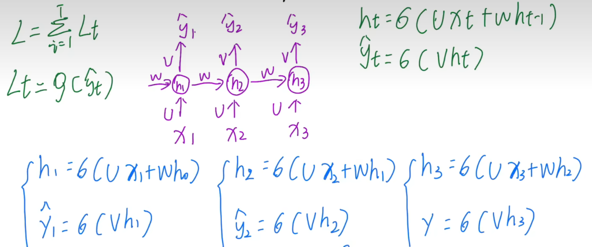

# CW1 info

due：2/14

submission：

* 两个单独的提交窗口
  * **Code**: submit a **zip** with your code, these are questions Q1 and Q3 a), b), c) in the assignment. 
  * **Report**: submit a written report in **pdf** format.

# Q1

RNN 反向传播:

* 将输出层的 Loss 加和, 然后对各个权重的参数矩阵求梯度, 再用 GD 更新权重 V, W, U

  * 等价于对每个时间步的三个参数矩阵先求关于loss的梯度, 最后再求和 (求t个时间步的总梯度, 然后更新)

* 总梯度: 累加各个时刻的梯度

  * W: 简单. 不涉及和之前状态的依赖. 直接在每个时刻求梯度, 然后累加即可

  * [U & V](https://www.bilibili.com/video/BV1fF411P72y/?spm_id_from=333.1007.top_right_bar_window_history.content.click&vd_source=6efc88808efed39f9b6bb6405566964c):

    * e.g., 总共 3 个时间步, 以 t=3 时的梯度为例:

      * h2 和 h1 应被看作关于 U 的函数. (V 也同理)

      > N.B., 图片中的符号与 CW1 中的不同. 对应关系(图片->CW1): W -> U, V -> W, U -> V

      

    

    

    

* 梯度消失/梯度爆炸的风险来源于上图中的累乘部分

  

  * 解决方法
    * LSTM, GRU
    * CW1 中提到的 truncated BPTT ?